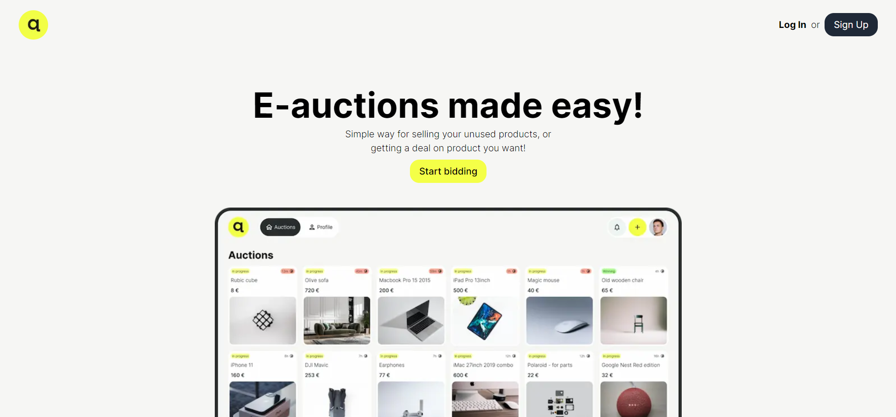
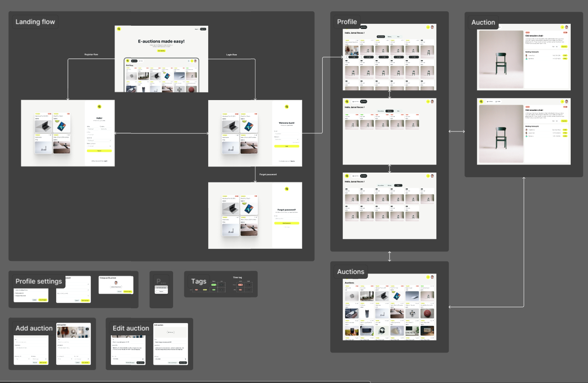
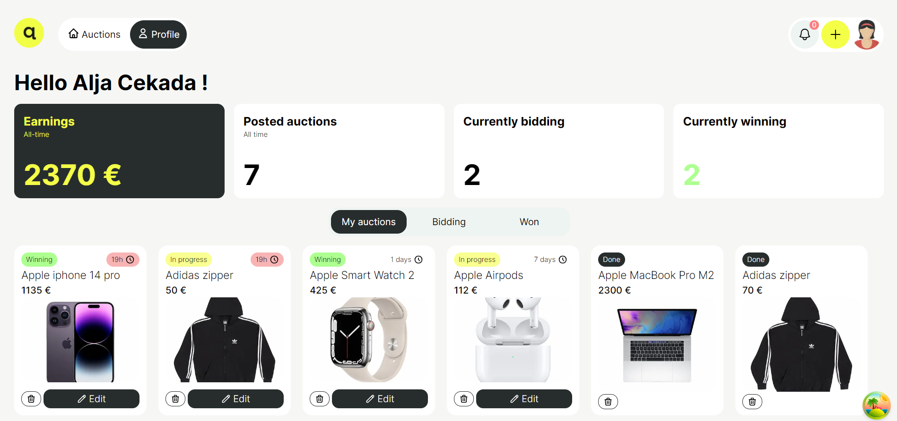
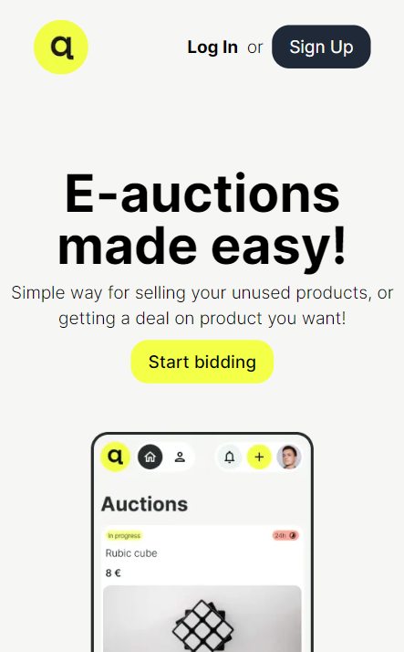
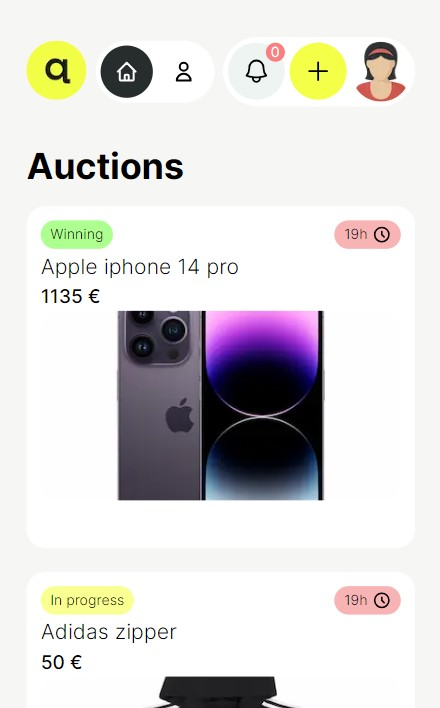
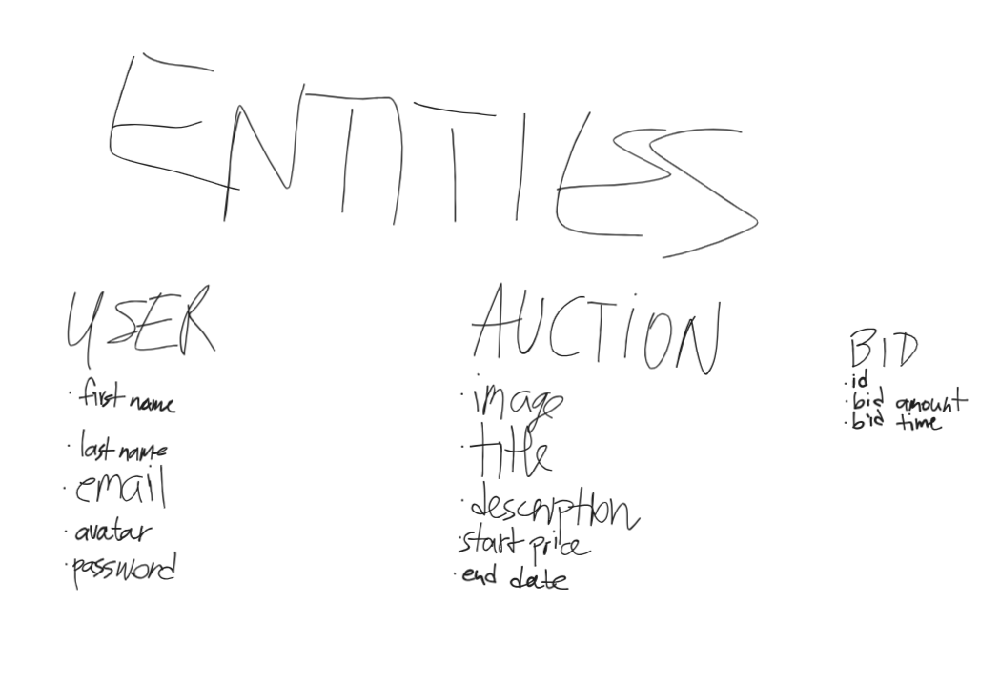
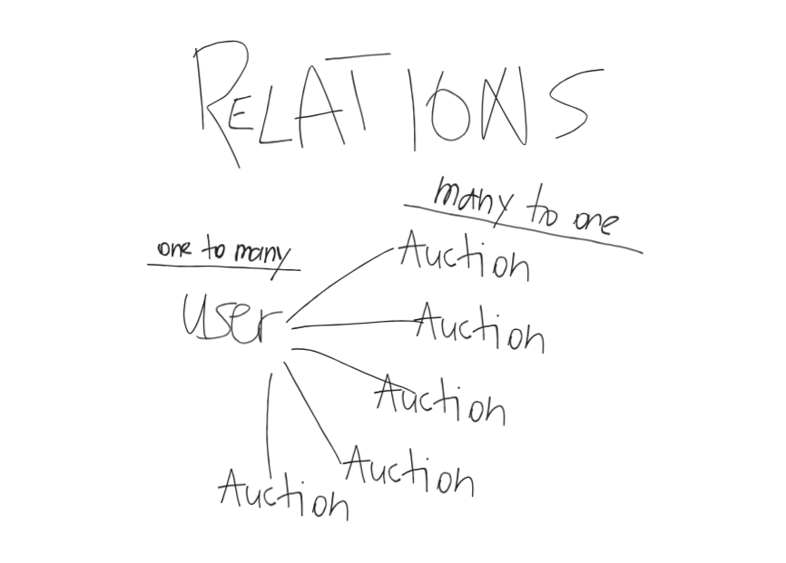
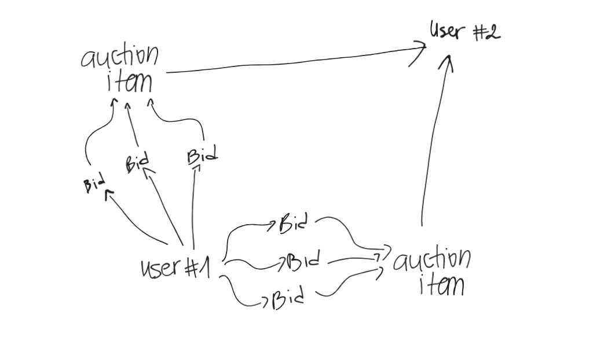
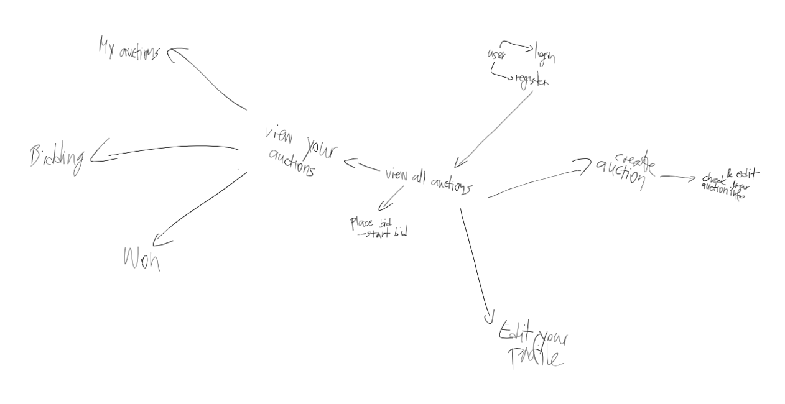
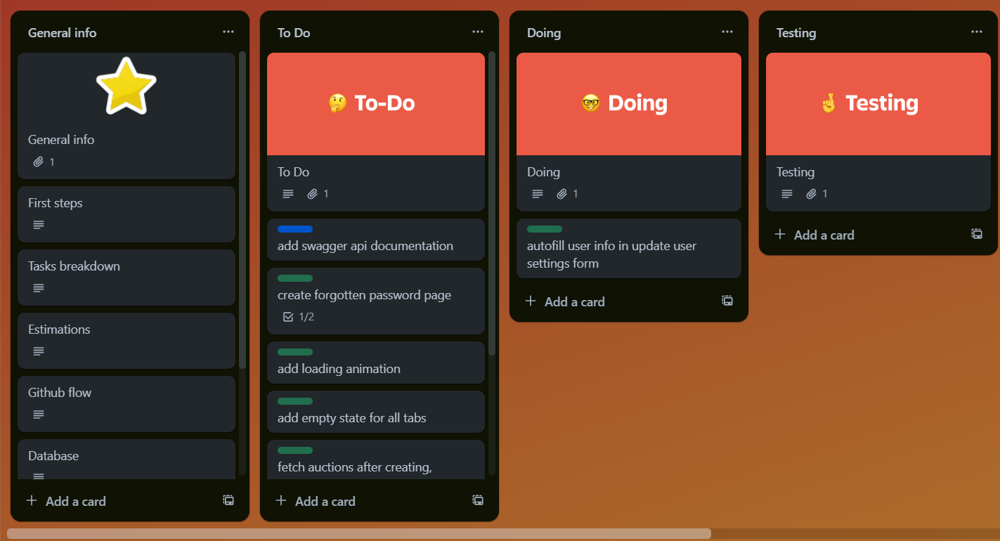

# AuctionBay WebApp

*DISCLAIMER*
*Deployment to AWS in progress. Stay tuned for live demo.*

## Table of Contents
- [Overview](#overview)
- [Design](#design)
- [Logic](#logic)
- [Arhitecture](#arhitecture)
- [Database Design](#database-design)
- [Page Structure](#page-structure)
- [Tools](#tools)

# AuctionBay WebApp

## Overview
AuctionBay is an online auction platform that empowers users to create and manage auction events. Registered users can initiate auction events by providing essential details such as images, event titles, descriptions, starting prices, and durations. Bidders have the ability to actively participate in auctions, place bids, and track the status of their bids. Meanwhile, sellers can efficiently manage their auction events and access comprehensive bidding histories.

## Design

I have replicated the design for this project based on the Figma design provided. The user interface, layout, and visual elements closely follow the specifications outlined in the Figma design file. This ensures consistency between the design and the implementation.

## Logic

### User Authentication Logic

- Users can register by providing their first and last names along with their email.
- Passwords are securely hashed and stored.
- JWT Token-based authentication is implemented to ensure secure user sessions.
- Password reset functionality is facilitated through a reset email containing a link directing users to a password reset form.

### Auction Creation Logic

- Users have the capability to create new auctions, furnishing them with details such as a title, description, image, end date, and starting price.
- Auctions are scheduled with defined start and end times, becoming active during the specified period.
- After the conclusion of an auction, it becomes inaccessible for viewing or editing.

### Bidding Logic

- Users can place bids on active auctions.
- Bids must surpass the current highest bid or starting price.
- Recorded bid amounts are reflected in the auction's current bid.
- The status of the auction is updated upon bid placement, indicating whether a user is winning or has been outbid.
- Notifications are sent to all users when a bid is placed on a specific item.

### Auction Monitoring Logic

- Users can access detailed information about an auction, including current bids.
- Users have visibility into auctions they have created, auctions they are actively bidding on, and auctions they have won, including associated earnings.
- Countdown timers display the time remaining for each auction.
- Notifications are sent when there are 24 hours or less remaining for a specific auction.

### Auction Update Logic

- Users have the ability to update details of their actively created auctions.
- Users can also opt to delete auctions they have created.

### User Settings Logic

- Users can update their profile details, including name, email, and password.
- Additionally, users can customize their avatar images to enhance their profile.

## Arhitecture

### Overview

AuctionBay's architecture is designed to be scalable, modular, and maintainable. The system follows a microservices architecture, allowing for flexibility and independent development of different components. Key components include the frontend, backend, database, and external services.

### Components

#### Frontend

The frontend of AuctionBay is a multi-page application (MPA) built using ReactJS and Next.js. This combination of technologies offers a powerful and flexible framework for crafting dynamic and interactive user interfaces. ReactJS provides a component-based architecture, allowing for the creation of modular and reusable UI elements, while Next.js simplifies server-side rendering, routing, and deployment.

#### Backend

The backend of AuctionBay is the powerhouse responsible for processing requests from the frontend, executing business logic, and interacting with the database. This critical component is built using NestJS, a powerful and modular Node.js framework designed for building scalable and maintainable server-side applications.

- Dependency Injection: AuctionBay utilizes Dependency Injection within its NestJS backend architecture. This enhances code modularity, allowing for the efficient management of components and services.

- TypeORM Integration: The project seamlessly integrates TypeORM, a popular Object-Relational Mapping (ORM) library. This enables the backend to interact with the database, facilitating efficient data modeling and retrieval using TypeScript entities.

- Decorators for Routing: AuctionBay simplifies route definition and HTTP request handling through the use of decorators for routing within the NestJS framework. This approach reduces boilerplate and enhances code expressiveness.

- Server-Sent Events (SSE) for Notifications: To facilitate real-time updates, such as bidding notifications, AuctionBay employs server-sent events. This mechanism enables bid-related notifications to be pushed from the server to connected clients in real-time, enhancing the overall user experience.

#### Database

AuctionBay relies on PostgreSQL as its central data store. This choice is driven by PostgreSQL's reliability, support for complex queries.

The relational database within AuctionBay is crucial in storing a variety of information, including user profiles, auction details, and bid details.

Each table in the database corresponds to a specific entity, such as users, auctions, and bids, and is structured to maintain the relationships between these entities. This relational model facilitates seamless data retrieval and enables the enforcement of constraints, ensuring data accuracy and integrity.

#### Authentication

AuctionBay secures user authentication using JSON Web Tokens (JWT). Upon successful login, the server generates a JWT token containing pertinent user information, which is then transmitted to the client. Subsequent user requests include this token, allowing the server to authenticate users without the need for repeated login credentials. The stateless nature of JWT ensures secure and efficient user validation, enhancing the overall security and scalability of AuctionBay's authentication process.

#### Communication

AuctionBay utilizes RESTful APIs for seamless communication between the frontend and backend. Real-time updates, including bidding notifications and auction expiry alerts, are facilitated through Server-Sent Events (SSE). The platform further enhances efficiency with cron jobs, automating tasks such as auction expiration for a streamlined user experience.

### Security

Password are securely stored using advanced hashing techniques. Route guards are implemented to control access to specific routes, ensuring that only authenticated and authorized users can utilize designated functionalities.

## Database Design

## Page Structure

Here's an overview of the primary pages:

### 1. **Landing Page**

- **Description:** The landing page welcoming users to AuctionBay.
- **Components:**
  - Sign-up and login options.
  - Forgotten password page.
 
### 2. **Authentication Pages**

- **Description:** Handles user registration, login, and password reset.
- **Components:**
  - Forms for inputting credentials.
  - Links for navigating between registration, login, and reset password.

### 3. **Auction Listing Page**

- **Description:** Displays a list of ongoing auctions.
- **Components:**
  - Auction cards with images, titles, auction status, current bids, and time remaining.
 
### 4. **Auction Details Page**

- **Description:** Provides detailed information about a specific auction.
- **Components:**
  - Auction title, description, and image.
  - Current bid information.
  - Place bid button.
  - Bidding history.
  - Countdown timer for auction duration.

### 5. **User Profile Pop-up**

- **Description:** User-specific information and settings.
- **Components:**
  - User details and avatar.
  - Account settings and password update.

### 6. **Create Auction Pop-up**

- **Description:** Allows users to create a new auction.
- **Components:**
  - Form for entering auction details (title, description, images, start price, and end date).

 

## Tools
### Frontend:
- HTML
- CSS
- Figma (Design tool)
- JavaScript
- TypeScript
- React (JavaScript library for building user interfaces)

### Backend:
- Node.js (JavaScript runtime)
- NestJS (Framework for building efficient, scalable server-side applications)
- Express (Web application framework for Node.js)

### API Documentation:
- Swagger (API documentation and testing)

### Containerization and Deployment:
- Docker (Platform for developing, shipping, and running applications in containers)
- AWS (Amazon Web Services, cloud computing platform)

### Version Control and Collaboration:
- Git (Version control system)
- GitHub (Web-based platform for version control and collaboration)

### Database:
- PostgreSQL (Relational database management system)

### ORM (Object-Relational Mapping):
- TypeORM (Database toolkit and ORM for Node.js and TypeScript)

### Authentication:
- JSON Web Tokens (JWT, for secure authentication)

### API Testing:
- Postman (API development and testing tool)

### Project Management:
- Trello (Project management tool for collaboration and task tracking)

